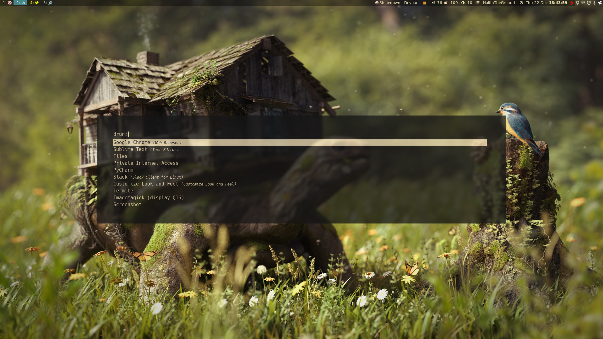
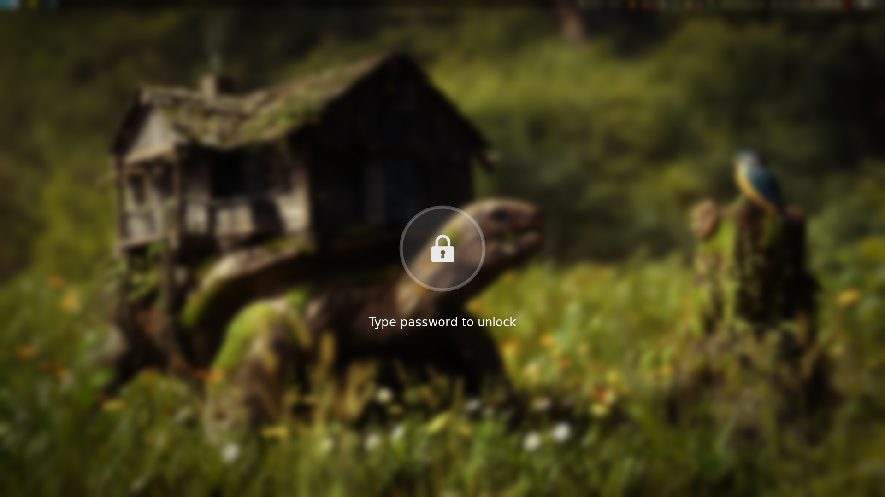
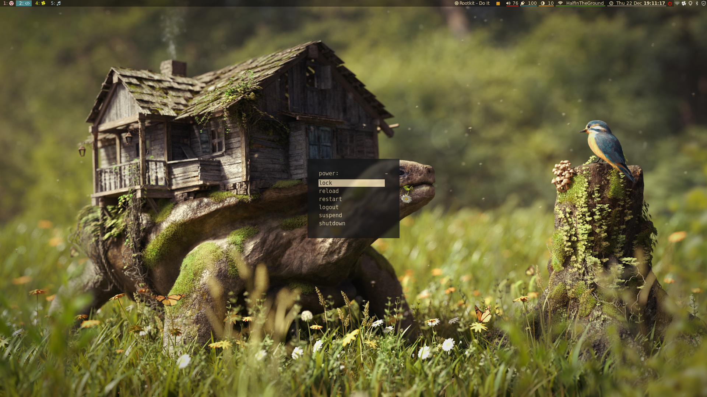
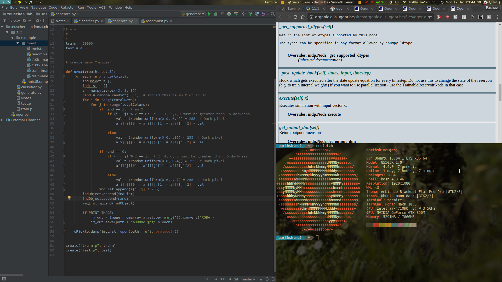

# dotfiles
My i3-gaps config. 
Things I'm using:

- Bar: i3bar with i3blocks
- Terminal: termite (powerline sometimes)
- font: font awesome, hack, and ubuntu
- compositing: compton (added custom blur kernel)
- d-menu: rofi
- theme: dark-mono-red
- OS: Ubuntu
- notifications: dunst
- calendar: gsimplecal

Notes:

- volume and brightness are clickable and scrollable
- battery block shows when computer is being plugged in, charging, discharging, etc (changes colors as well)
- mediaplayer at top is clickable
- custom icons for slack and pia
- screenshot utility is maim
- date/time is clickable, shows gsimplecal (very similar to ubuntu)

